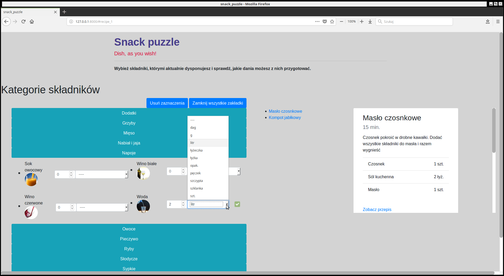
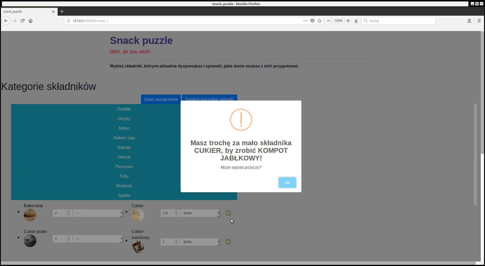
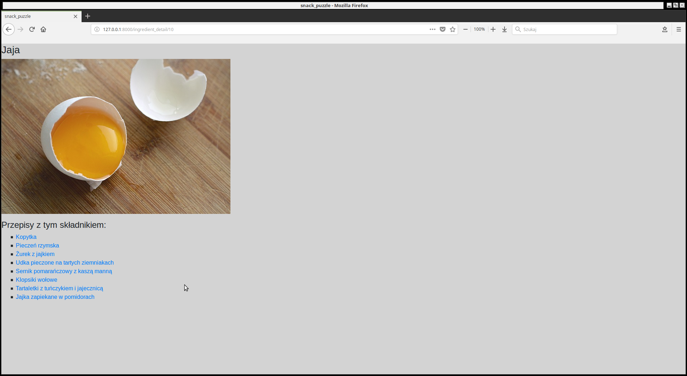

# snack_puzzle_ver2
The application allows users to check which recipes can be prepared with ingredients at hand. 
The application will inform us when we are close to generating any recipe (together with the amount of lacking ingredient). 
Logged in users can add their own recipes. 

<a href="https://snack-puzzle.herokuapp.com/">Application deployed on heroku server</a>

Implemented:
- Notification when ingredient amount is too low
- Notification when wrong ingredient measure was chosen
- User register and login
- User recipe form
- Searching by time needed for every recipe
